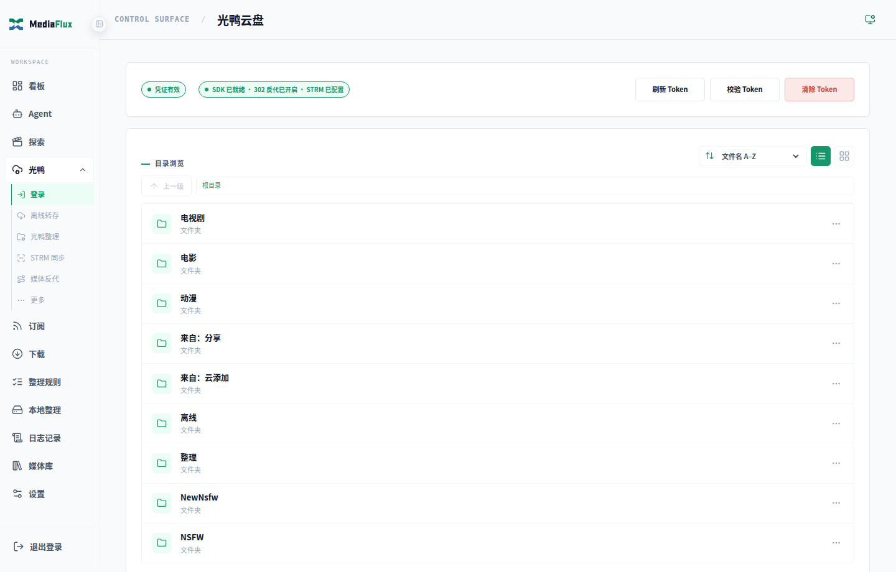
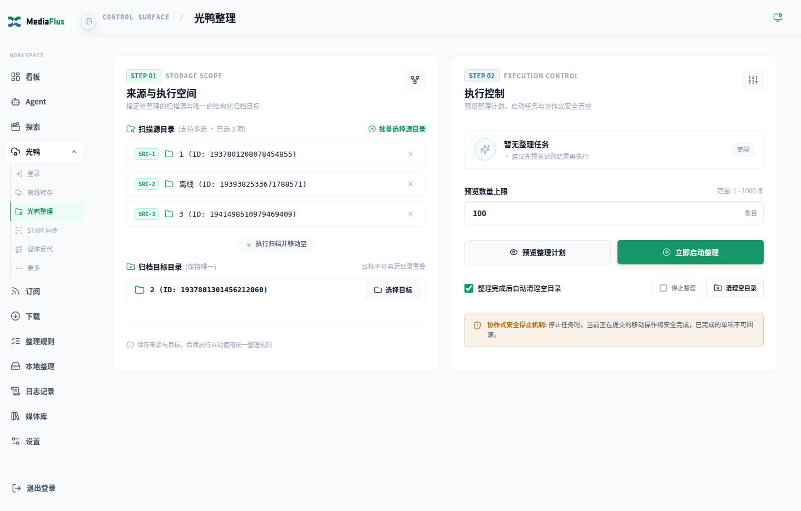
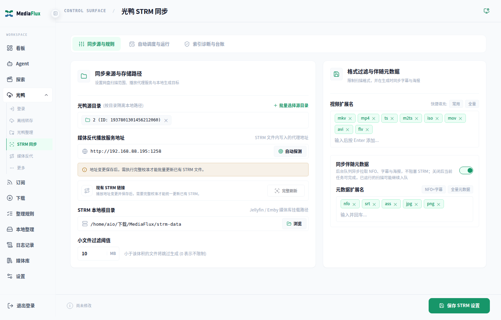

# 光鸭云盘影视整理、STRM 生成与 Emby/Jellyfin 302 反代：MediaFlux 部署教程

如果你希望把光鸭云盘中的影视按 TMDB 识别归档，生成本地 STRM 文件，并通过 Emby / Jellyfin 播放，本教程给出一条完整的 MediaFlux 配置与核验流程。

MediaFlux 负责云盘整理、STRM 同步和媒体反代；Jellyfin / Emby 负责媒体库与播放协商，播放器负责实际播放。**本项目不提供媒体内容，也不替代媒体服务器或播放器。**

> **先说明一个关键概念：配置了 302，不代表所有请求都会返回 302。**
> MediaFlux 会根据媒体来源、客户端能力、协议和 Jellyfin / Emby 的 `PlaybackInfo` 结果，在“真 302、兼容中继、HLS / 转码”之间自动选择。一套媒体反代即可协商这些链路，不需要为不同客户端再创建额外的 302 策略。

## 适用范围与准备条件

适合：已经拥有合法的光鸭云盘媒体，希望完成“云端整理 → 本地 STRM → 媒体库 → 播放”的用户。如果只整理本地实体视频，请阅读[本地媒体整理教程](03_本地媒体安全移动与qBittorrent联动实战.md)；本地视频不走本文的光鸭 CDN 直链流程。

开始前请准备：

- 可运行 MediaFlux 的设备；按[部署指南](../部署指南.md)完成安装，首次访问 `/setup` 创建管理员。
- 可以登录的光鸭云盘账号，以及用于首次核验的少量媒体文件；不要直接拿整个媒体库试运行。
- 可用的 TMDB API Key，供影视识别整理使用。
- 已运行的 Jellyfin 或 Emby、相应 API Key，以及一个实际使用的播放器。
- MediaFlux 可写、媒体服务器可读的 STRM 本地目录；它与云盘中的归档目录是两个不同位置。

只跑通本教程的手动链路，不需要先配置 qBittorrent、RSS、Telegram 或 Agent 模型。自动订阅与 Agent 操作可以在基础链路验证后再开启。

## 从光鸭文件到播放器：首次配置顺序

```text
部署与初始化
  → 登录光鸭、配置 TMDB
  → 选择小范围源目录，预览并确认云端整理
  → 选择整理后的目录，生成 STRM
  → Jellyfin / Emby 挂载并扫描 STRM 媒体库
  → 创建 MediaFlux 媒体反代实例
  → 播放器连接反代入口，核验实际媒体 GET 请求
```

### 第一步：登录光鸭并配置识别

1. 进入 **「光鸭 → 登录」**（`/guangya`），完成短信验证，确认能够浏览自己的云盘目录。
2. 进入 **「设置 → 刮削识别」**，填写 TMDB API Key 并保存。具体字段和连接检查见[配置教程](../配置教程.md)。
3. 如果目录或 TMDB 不可访问，先排查登录与网络，不要通过反复执行整理来测试连接。



### 第二步：先预览，再确认云端整理

1. 打开 **「整理规则」**（`/organize-rules`），核对分类目录、识别确认及冲突策略；首次使用优先保留需要人工确认的结果，避免覆盖已有媒体。
2. 打开 **「光鸭整理」**（`/organize`），选择专门用于核验的光鸭源目录和归档目标。来源和目标不能重叠。
3. 点击 **「预览整理计划」**，检查作品、年份、季集号、目标路径及冲突情况。预览不会移动、改名或删除云盘文件。
4. 核对后点击 **「立即启动整理」**，按确认框要求输入 `ORGANIZE` 并确认。这个步骤才会实际修改云盘文件；存在错误匹配时，应先处理映射或识别规则，再重新核对。
5. 查看任务状态与日志，确认核验目录处理结果正确后，再扩大来源范围或开启自动任务。

> **预览数量上限不是正式整理任务的范围限制。** 正式任务按当前选择的源目录和规则执行，不是只处理上次预览展示的几条文件。首次核验应使用独立的小目录；停止任务也不会自动回滚已经完成的云盘移动。

下面只是整理前后的结构示意，不是一次实测结果；作品名称、分类和媒体规格以后续预览为准：

```text
整理前：光鸭 /待整理/影片原始发布文件名.mkv
整理后：光鸭 /影视库/电影/影片名 (年份) {tmdb-ID}/规范化影片文件名.mkv
STRM：本地输出目录/对应来源子目录/电影/影片名 (年份) {tmdb-ID}/规范化影片文件名.strm
```



### 第三步：生成 STRM，而不是下载整部视频

进入 **「光鸭 → STRM 同步」**（`/guangya/strm`）：

1. 选择**整理后的光鸭目录**作为同步来源，避免继续同步已经搬空的待整理目录。
2. 设置本地输出根目录 `STRM_ROOT`。默认 Docker 挂载中，容器内 `/data/strm` 对应宿主机的 `./strm`；不要把宿主机路径直接当作容器内路径填写。
3. 设置**媒体反代播放服务地址** `GY_STRM_BASE_URL`：它指向媒体服务器与播放器都能访问的 **MediaFlux Web 地址**，例如 `http://192.168.1.100:1258`。它不是 Jellyfin 的 `8096` 地址，也不是媒体反代实例的 `18096` 端口。
4. 点击 **「保存 STRM 设置」**，再执行 **「完整校准」**，检查同步统计、失败项和输出目录中的 `.strm` 文件。
5. `.strm` 应保存 MediaFlux 的 `/playgy` 播放入口，不应直接保存会过期的云盘 CDN signed URL。地址发生变化时，保存后还要完整校准已有 STRM。

STRM 是本地播放入口文件，不是视频副本。是否同步字幕、NFO 等伴随文件由对应配置控制，不能把生成 STRM 理解成已下载全部媒体。



### 第四步：接入媒体库与反代，并完成一次播放核验

接下来按本文[挂载与端口示例](#4-docker-compose-端口与挂载示例)、[媒体服务器配置](#5-mediaflux-与媒体服务器配置)完成接入，再按[播放核验](#6-如何确认当前到底是不是真-302)观察真实请求。

先区分这三个地址（端口均可按部署调整）：

| 地址用途 | 局域网示例 | 填在哪里 |
| --- | --- | --- |
| MediaFlux Web 与 STRM `/playgy` 入口 | `http://192.168.1.100:1258` | STRM 的 `GY_STRM_BASE_URL` |
| Jellyfin / Emby 真实上游 | `http://192.168.1.100:8096` | 媒体服务器配置、媒体反代的上游地址 |
| MediaFlux 媒体反代入口 | `http://192.168.1.100:18096` | 播放器添加 Jellyfin / Emby 服务器时填写 |

首次验收不要只看“能显示海报”：还应确认整理结果、STRM 挂载、实际播放及所走链路。只有真实媒体 GET 返回 302 并让播放器直连 CDN，才能按“真 302”理解流量路径。

---

## 1. 三种实际播放链路

### 1.1 真 HTTP 302：客户端直接从光鸭 CDN 取视频

```text
客户端播放器
   │ 1. 通过媒体反代端口访问 Jellyfin / Emby
   ▼
MediaFlux 媒体反代 ───────► Jellyfin / Emby
   │                         │
   │ 2. 获取播放信息          │ 读取本地 .strm
   │ 3. 获取短时 signed URL   │
   ▼                         │
光鸭云盘 API                 │
   │                         │
   └── 4. MediaFlux 返回 HTTP 302 + Location: https://...guangyacdn...
                              │
客户端播放器 ────────────────┴──► 光鸭 CDN
             5. 直接拉取视频数据
```

真 302 时：

- Jellyfin / Emby 和 MediaFlux 仍负责登录、海报墙、播放协商与鉴权；
- 实际视频数据由播放器直接向光鸭 CDN 请求；
- MediaFlux 只处理控制请求和短时播放地址，不承载持续的视频下行流量；
- CDN 看到的是播放器出口 IP，而不是 MediaFlux 服务器出口 IP。

### 1.2 兼容中继：视频经过 MediaFlux，但不一定转码

```text
客户端播放器 ◄──── HTTP 200 / 206 ──── MediaFlux ◄──── 光鸭 CDN
```

当客户端无法安全跟随当前重定向链、浏览器受到跨域限制，或 Media3 / ExoPlayer 遇到 HTTP → HTTPS 跨协议兼容问题时，MediaFlux 会代理 Range 请求。此时通常仍是原始媒体直放，但视频流量会经过 MediaFlux。

### 1.3 HLS、转封装或转码：由 Jellyfin / Emby 负责

```text
客户端播放器 ◄──── .m3u8 / .ts / .m4s ──── Jellyfin / Emby
```

当容器、视频、音频或字幕不符合客户端能力时，Jellyfin / Emby 可能选择 HLS、转封装或转码。这类请求不会强制改成 302，以免得到“显示为直连、实际无法播放”的错误结果。

---

## 2. 当前客户端如何自动选择链路

| 客户端 / 场景 | 常见链路 | 说明 |
| --- | --- | --- |
| Infuse、VidHub、Fileball | **真 302 优先** | 客户端能跟随重定向且可直接解码该媒体时，视频数据直连 CDN |
| Yamby、Moonfin | **真 302 优先** | MediaFlux 保留其已验证可用的 signed URL 直连路径 |
| Jellyfin Android 原生播放器 | 真 302 或兼容中继 | 同协议链路可使用 302；MediaFlux 为 Media3 / ExoPlayer 的 HTTP → HTTPS 场景自动使用兼容中继 |
| Findroid | **兼容中继** | 当前使用已验证的完整 signed-media 中继链，播放成功不等于网络面板必须出现 302 |
| Jellyfin Web / Android 网页播放器 | 真 302、兼容中继或 HLS | 只有准确媒体版本被上游判定为可 Direct Play 时才允许真 302；仍受浏览器编解码和 CDN CORS 限制 |
| Jellyfin / Emby 本地实体视频 | 上游直放、转封装或转码 | 本地视频不属于光鸭 STRM 302 链路，继续交给上游媒体服务器处理 |

以下请求本来就不应被判断为“真 302 视频流”：

- 登录、海报、字幕、媒体详情、播放进度和 WebSocket；
- `HEAD` 探测请求；
- HLS 清单与分片（`.m3u8`、`.ts`、`.m4s`）；
- 客户端显式关闭 Direct Play / Direct Stream 的请求；
- 无法唯一绑定到光鸭文件、鉴权失败或 signed URL 获取失败的请求。

---

## 3. 媒体库目录结构规划

推荐在宿主机统一规划 STRM 输出目录，并只读挂载给 Jellyfin / Emby。下面是结构示意，来源子目录与实际文件名以同步输出为准：

```text
/data/strm/
└── 光鸭云盘/
    ├── 电影/
    │   └── 肖申克的救赎 (1994) {tmdb-278}/
    │       └── 肖申克的救赎.1994.2160p.strm
    └── 剧集/
        └── 葬送的芙莉莲 (2023) {tmdb-209867}/
            ├── Season 1/
            │   ├── 葬送的芙莉莲.2023.S01E01.1080p.strm
            │   └── 葬送的芙莉莲.2023.S01E02.1080p.strm
            └── Specials/
                └── 葬送的芙莉莲.2023.S00E01.OVA.1080p.strm
```

Jellyfin / Emby 看到的路径可以与 MediaFlux 不同，但二者必须挂载同一批文件。只有绝对路径确实不一致时，才需要在媒体服务器配置中添加高级路径映射。

---

## 4. Docker Compose 端口与挂载示例

根目录的 `docker-compose.yml` 默认使用 **host 网络**：Web 与媒体反代直接使用宿主机端口，不需要再写 `ports`。保留此部署方式时，Jellyfin / Emby 上游应填写实际可达的宿主机或局域网地址，不要照搬下面 bridge 网络中的服务名。

下面仅展示一个 **bridge 网络**下的 MediaFlux + Jellyfin 组合示例。它不是与 host 同时启用的配置：从默认 Compose 改用此方案时，必须先移除 MediaFlux 的 `network_mode: host`，保留需要的数据卷，并将两服务放在同一个 Compose 网络。完整部署、持久化与升级说明仍以[部署指南](../部署指南.md)为准：

```yaml
services:
  mediaflux:
    image: ghcr.io/li88iioo/mediaflux:latest
    container_name: mediaflux
    ports:
      # MediaFlux Web 与 STRM /playgy 播放入口
      - "0.0.0.0:1258:1258"
      # 媒体反代实例示例端口；必须与页面中的实例监听端口一致
      - "0.0.0.0:18096:18096"
    volumes:
      - ./data:/app/db
      - /mnt/media/strm-data:/data/strm

  jellyfin:
    image: jellyfin/jellyfin:latest
    container_name: jellyfin
    volumes:
      - /mnt/media/strm-data:/media/strm:ro
      - ./jellyfin-config:/config
    ports:
      - "8096:8096"
```

注意：

- MediaFlux 容器内部 Web 端口固定为 `1258`；宿主机端口可按部署配置调整；
- `18096` 只是媒体反代实例的示例端口，每个实例都可以使用不同端口；
- Docker bridge 网络下，新增或更换实例端口后，要同步发布对应端口；
- 局域网示例使用 `0.0.0.0` 便于其他设备访问。公网部署应使用防火墙、鉴权和有效 HTTPS 反向代理，不要直接裸露管理端口。

---

## 5. MediaFlux 与媒体服务器配置

### 5.1 设置 STRM 播放地址

进入 **「光鸭 → STRM 同步」**（`/guangya/strm`），找到 **「媒体反代播放服务地址」**：

1. 填写 Jellyfin / Emby 与实际播放器都能访问的 MediaFlux 地址，例如：
   - 局域网：`http://192.168.1.100:1258`
   - HTTPS 域名：`https://media.example.com`
2. 不要填写 `localhost` 或 `127.0.0.1`，除非媒体服务器和播放器确实与 MediaFlux 处于同一个网络命名空间；
3. 地址保存后执行一次**完整刷新 / 完整校准**，让已有 `.strm` 批量写入新地址；
4. 选择已整理的光鸭源目录并执行完整同步。

`.strm` 文件中写入的是 MediaFlux `/playgy` 播放入口。signed URL 是短时地址，由 MediaFlux 在播放时实时获取，不要把 CDN signed URL 手工写进 STRM。

### 5.2 创建媒体反代实例

进入 **「光鸭 → 媒体反代」**（`/guangya/media-proxy`）的反代实例页：

1. 选择已配置的 Jellyfin / Emby，或填写自定义上游地址；
2. 上游地址填写真实媒体服务器地址；仅当使用上面的同网络 bridge 示例时，可填写 `http://jellyfin:8096`，host 部署使用实际可达的宿主机或局域网地址；
3. 设置独立监听地址与端口，例如 `0.0.0.0:18096`；
4. 保存并加载后，确认实例显示“运行中”且连接测试正常；
5. **播放器以后连接媒体反代入口**，例如 `http://192.168.1.100:18096`，而不是绕过 MediaFlux 直接连接上游 `:8096`。

媒体反代负责转发 Jellyfin / Emby API、WebSocket 和本地视频请求，并只对能够精确识别的光鸭媒体改写播放链路。绕过媒体反代直接访问 `8096` 时，本文描述的客户端自动协商不会生效。

### 5.3 添加 Jellyfin / Emby 媒体库

以 Jellyfin 为例：

1. 在 Jellyfin 中添加电影、剧集等媒体库；
2. 目录选择容器内的 STRM 挂载路径；若采用上面的结构示例，则为 `/media/strm/光鸭云盘/电影`，实际应选择同步生成的对应来源子目录；
3. 在 Jellyfin 控制台创建 API Key，并在 MediaFlux 的媒体服务器配置中保存；
4. 启用整理或 STRM 完成后的媒体库刷新；
5. 首次同步后执行一次媒体库扫描。

---

## 6. 如何确认当前到底是不是“真 302”

不要只看“能否播放”，也不要用 `curl -I` 判断。MediaFlux 会把 `HEAD` 当作安全探测处理，它不代表真实视频 GET 的最终链路。

检查播放器实际发出的媒体 `GET` 请求：

| 现象 | 当前链路 |
| --- | --- |
| MediaFlux 返回 `HTTP 302`，并带有 `Location: https://...guangyacdn...` | **真 302**；后续大流量由客户端直连 CDN |
| MediaFlux 持续返回 `HTTP 200 / 206` 和 Range 数据 | **兼容中继**；视频流量经过 MediaFlux |
| 请求 URL 包含 `.m3u8`、`.ts`、`.m4s`、`/hls` 或 `/master` | **Jellyfin / Emby HLS、转封装或转码链路** |
| 本地视频直接由 Jellyfin / Emby 返回 | 正常本地媒体链路，不属于光鸭 302 |

真 302 下，MediaFlux 只会出现获取 signed URL 和返回重定向的短请求，不应持续产生与视频码率相当的下行流量。

---

## 7. 客户端 IP 与 Jellyfin “Known Proxies”

MediaFlux 默认丢弃外部传入的转发头，只把实际 TCP 对端 IP 转发给 Jellyfin。若播放器直接连接媒体反代实例，无需额外配置。

当链路前面还有 Nginx、Caddy、负载均衡器或 FRP 隧道，并且希望 Jellyfin 设备页显示最终客户端 IP：

1. 编辑对应的媒体反代实例，展开 **「真实客户端 IP」**；
2. 开启 **「信任上游转发头」**；
3. 在 **「可信代理来源」** 中至少填写 MediaFlux 实际收到连接的直接来源 IP/CIDR，例如 Docker bridge 下可能是 `172.18.0.1/32`；若 `X-Forwarded-For` 中还包含其他受控中间代理，也应逐项加入；
4. MediaFlux 只有在 socket 对端命中该列表时才解析 `X-Forwarded-For`，并按可信代理链从右向左选择首个不可信地址；其他请求仍会丢弃伪造头；
5. 在 Jellyfin 的 **Known Proxies（已知代理）** 中，只填写 Jellyfin 实际看到的 MediaFlux 直连地址。它与 MediaFlux 表单中的“可信直接代理来源”属于链路的不同一跳，不应机械填写为同一个值。

不要填写 `*`、`0.0.0.0/0` 或 `::/0`。若局域网直连用户与可信入口经过同一个 NAT 地址进入 MediaFlux，应先通过防火墙限制该实例端口只允许可信入口访问，否则不要启用转发头信任。该功能只影响 Jellyfin / Emby 看到的客户端 IP，不改变真 302、兼容中继或 HLS 的播放选择。

另外：

- 真 302 时，光鸭 CDN 看到播放器出口 IP；
- 兼容中继时，光鸭 CDN 看到 MediaFlux 服务器出口 IP；
- Jellyfin 设备页显示的 IP 与 CDN 实际取流 IP 不是同一个概念。

---

## 8. 常见问题

### 播放器能登录，但光鸭 STRM 不走 302

依次检查：

1. 播放器连接的是媒体反代实例端口，而不是上游 Jellyfin / Emby 端口；
2. 媒体反代实例已启用，且监听端口已由 Docker / 防火墙放行；
3. STRM 内的 MediaFlux 地址可被媒体服务器和播放器访问；
4. 当前媒体能唯一匹配到光鸭文件，没有错误的 Item / MediaSource 映射；
5. 当前客户端是否进入了兼容中继或 HLS——这可能是正确降级，不一定是故障。

### Jellyfin Web 能打开媒体，但浏览器播放失败

浏览器除编解码能力外，还受 CDN CORS 和媒体元素安全策略限制。即使 Jellyfin 报告 `SupportsDirectPlay=true`，浏览器环境也不保证像原生播放器一样稳定跟随 CDN 直链。需要优先验证：

- 是否实际请求了 HLS 清单；
- 浏览器控制台是否出现 CORS 或 codec 错误；
- 同一媒体在 Infuse、VidHub、Yamby、Moonfin 等原生客户端是否正常。

不要为了追求网络面板中的“302”而强制关闭 Jellyfin 的必要转码或 HLS 回退。

### 本地视频没有 302

这是正常行为。本地实体视频继续由 Jellyfin / Emby 负责 Direct Play、Direct Stream 或转码；MediaFlux 不会把本地文件伪装成光鸭 CDN 直链。

---

## 9. 相关专题教程推荐

- 🧭 [**自动化流转全景与工作流程**](00_自动化流转全景与工作流程.md)
- 🌸 [**Mikan 番组计划全自动追番与标签过滤**](02_Mikan全自动追番与标签过滤实战.md)
- 📂 [**本地媒体安全移动与 qBittorrent 联动**](03_本地媒体安全移动与qBittorrent联动实战.md)
- ☁️ [**光鸭云盘影视归档、冲突策略与分享转存**](04_云盘大容量影视归档与冲突策略实战.md)
- 🛡️ [**整理纠偏审计、一键回退与映射锁实战**](05_纠偏审计与数据回退实战.md)
- 📺 [**Apple TV / Infuse / VidHub 302 直连配置与验证**](06_AppleTV与Infuse及VidHub终极直连配置.md)
- 🚀 [**性能调优与大规模媒体库优化指南**](07_性能调优与大规模媒体库优化指南.md)
