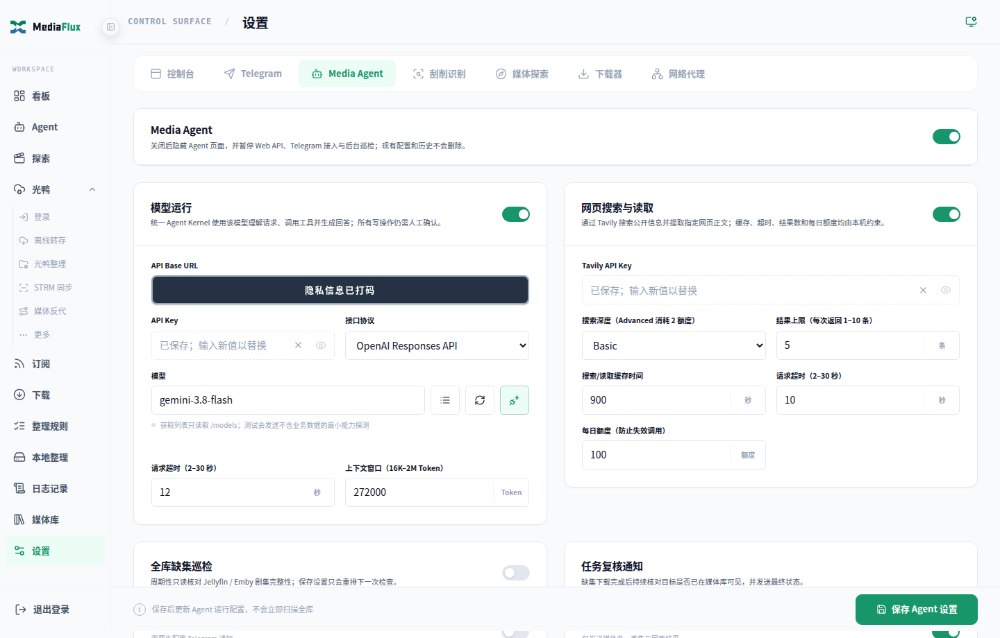
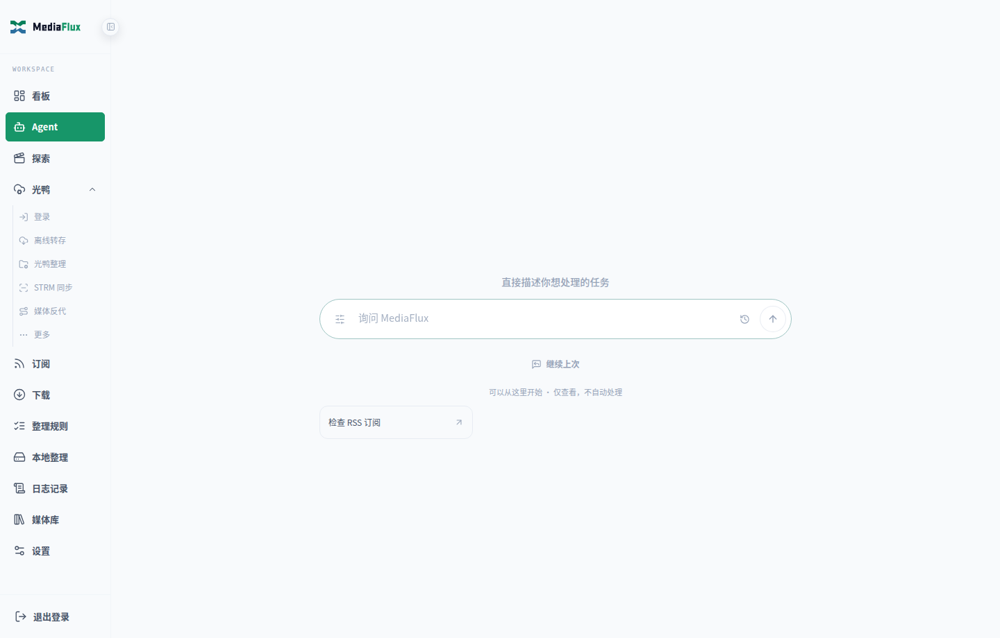

# Media Agent：架构、配置与使用实战

> 核对日期：2026-09-14。本文描述当前 `main` 的实现，不是未来架构提案。完整工具名称、风险等级和 Provider 操作见 [Agent 工具与能力参考](09_Agent工具与能力参考.md)。
>
> **工具已注册 ≠ 外部服务已配置 ≠ 本次请求一定成功。** 模型负责理解和选择，真实结果由领域服务提供；写入受后端确认机制约束。

## 1. Agent 在 MediaFlux 中的位置

Media Agent 是现有媒体业务的自然语言入口，不是第二套下载器、整理器或媒体服务器。可以通过 Web 的 `/agent` 页面或 Telegram 使用。

它适合把多个已有能力组合起来，例如：

- 查询媒体库数量、某个媒体库的剧集数、最近播放、继续观看和缺集情况。
- 从自己的库中筛选未看作品，结合题材与显式偏好推荐，并返回可用的媒体详情链接。
- 查询电影人的作品列表，批量比对本地收录情况，避免逐片调用耗尽预算。
- 搜索资源、选择版本、预检下载或分享转存，确认后提交并续查进度。
- 管理 RSS 规则订阅、媒体追更订阅、整理策略、STRM 同步与伴随元数据队列。
- 浏览光鸭目录，规划复制、移动、改名或移入回收站；查询回收站和分享，生成高风险操作预览。
- 查询运行活动、跟踪任务、检查可撤销范围，或按单独授权复核识别候选。

它**不是**向模型开放任意 Shell、任意本地文件读写、任意 HTTP 请求或完整第三方管理 API。工具和 Provider 操作都有明确范围。

## 2. 启用与配置

### 2.1 最小配置

在「设置 → Media Agent」中：

1. 开启 Media Agent 和 Agent 模型。
2. 填写 API Base URL、模型名称及服务要求的 API Key。
3. 选择接口协议；不确定时先使用自动模式，再用页面的连接测试核对工具调用、流式输出等能力。
4. 按模型实际支持的容量填写上下文窗口，保存后再发起新对话。
5. 按需求配置光鸭、Jellyfin/Emby、qBittorrent、TMDB 或资源站。没有配置的业务不会因为开启 Agent 自动变得可用。

| 配置项 | 作用 |
|---|---|
| `AGENT_ENABLED` | Agent 总开关 |
| `AGENT_LLM_ENABLED` | Agent 模型开关 |
| `AGENT_LLM_API_URL` / `AGENT_LLM_API_KEY` / `AGENT_LLM_MODEL` | 模型服务与凭据；不要把 Key 粘贴到聊天中 |
| `AGENT_LLM_PROTOCOL` | `auto`、`responses`、`chat_completions` 或 `anthropic_messages` |
| `AGENT_LLM_CONTEXT_WINDOW_TOKENS` | 默认 `128000`，可配置范围 `16384`–`2000000`；不是要求模型输出这么多 Token |
| `AGENT_LLM_TIMEOUT_SECONDS` | 模型请求超时配置；不是下载或整理后台任务的总时限 |
| `TG_AGENT_ENABLED` | Telegram 侧 Agent 开关；还需要 Bot 配置及身份授权 |

`auto` 模式的协议尝试不等于另起一个业务路由器。无论使用哪种模型协议，业务决策仍在同一个 Kernel 工具循环中。

**把上下文窗口填得更大不会扩大模型的真实能力。** 应不高于服务商为所选模型实际提供的上下文容量。Kernel 会先裁剪完整历史回合，再压缩当前工具结果；仍超预算时停止，而不是发送明知超长的请求。

配置项的完整说明见 [配置参考](../配置参考.md)，页面操作见 [配置教程](../配置教程.md)。



### 2.2 可选能力

| 需求 | 额外条件 |
|---|---|
| 实时网页搜索 | 开启 `WEB_SEARCH_ENABLED`，配置 `TAVILY_API_KEY`；仍受搜索额度、超时和缓存策略限制 |
| 公开网页正文读取 | 同样需要 `WEB_SEARCH_ENABLED` 与 `TAVILY_API_KEY`，使用 Tavily Extract；只读公开 HTTPS 页面，不是登录态浏览器或任意内网访问工具 |
| 最近播放、未看推荐 | 媒体服务器可用，并能确定对应用户；建议明确配置 `JELLYFIN_USER_ID` 或 `EMBY_USER_ID` |
| 全库巡检 | 单独配置 `AGENT_LIBRARY_PATROL_ENABLED`、周期及扫描上限；巡检通知还有独立开关 |
| 下载后入库复核通知 | `AGENT_DOWNLOAD_VERIFICATION_NOTIFY_ENABLED`；是否形成可复核任务还取决于提交结果和媒体线索 |
| 整理识别主动复核 | 单独开启 `AGENT_RECOGNITION_REVIEW_ENABLED`，详见第 7 节 |
| 光鸭 NSFW 清洗入库复核 | 另需 `AGENT_NSFW_CLEAN_REVIEW_ENABLED`；不是开启所有 NSFW 自动确认 |

## 3. 唯一运行架构

```text
Web / Telegram
    │ 登录身份、会话、文本或明确的确认/取消命令
    ▼
Kernel Transport
    ▼
AgentSession ───────── SessionState / ReferenceStore
    │                     会话、候选引用、待确认计划、发布代次
    ├─ CapabilityRetriever / 动态工具发现
    │      从目录取相关工具，不替模型裁决业务意图
    ├─ ModelAdapter
    │      统一模型协议与流式事件
    └─ ToolPipeline
           校验 → 解析引用 → 授权 → 限流 → 风险分类
           ├─ READ：调用 Domain Port → 现有业务 service/action
           └─ WRITE / DANGER：预检 → 冻结 EffectPlan → 暂停等待确认
                     │
                     ▼
               Projection + AgentEvent
                     │
                     └──────────→ Web / Telegram 展示
```

### 3.1 五个职责边界

| 组件 | 唯一负责的事情 | 不应该负责的事情 |
|---|---|---|
| 模型 | 自然语言理解、工具选择、多步规划和最终回答 | 绕过确认、伪造业务结果 |
| `ToolPipeline` | 参数、身份、引用、权限与副作用边界 | 用大量业务正则替代模型理解 |
| 领域服务 | qB、光鸭、媒体库、RSS、STRM 等真实业务事实 | 维护聊天界面或模型回合 |
| `SessionState` / 引用存储 | 会话上下文、候选集合、有效期和发布权限 | 让其他会话的“最近对象”替代当前选择 |
| 事件流 | 发布实际发生的工具、回答和确认进度 | 查询结束后回放 trace 冒充实时执行 |

生产代码不再使用旧 `AgentOrchestrator`、单工具 JSON selector 或回答后的第二次 presentation 模型。当前没有用 Pi、LangGraph 等通用 Agent 框架替代 Kernel。

### 3.2 一轮请求如何运行

```text
MODEL → TOOL → MODEL → TOOL → … → FINAL
                  │
                  └→ APPROVAL_REQUIRED：停止本轮，等待明确确认
```

- 初始工具召回通常为 **6–10 项**，不是把所有工具 Schema 一次发给模型。
- 窗口保留 `agent.capabilities`；模型可以根据当前问题继续发现能力，下一次模型调用再加载相关 Schema。
- 动态窗口硬上限为 **12 项**，每轮最多 **4 次**能力发现，仍计入工具调用预算。不能在同一批次发现后立刻猜测调用尚未加载的工具。
- 默认一轮最多 **12 个模型轮次、16 次工具调用**；增加上下文窗口不会自动增加这两个预算。
- 复杂查询应优先使用批量能力：存在性核对用 `library.batch_presence`，多部更新核对用 `library.check_updates`（每批最多 20 部、最多 3 部并发），不必先逐部搜索身份。
- 工具预算不足或模型轮次用完时，保留已完成事实并返回“部分完成”，可在同一会话回复“继续”；未执行的工具不会被当作完成，也不会自动扩大预算。

多部缺集接着找资源时，使用 `library.search_missing_season_resources.items` 一次检索，避免逐部搜索后只剩最后一部候选卡。每批最多 12 部/季、每部最多 3 个缺集，输出一个最多 12 项的统一候选快照；卡片显示作品名称和全局编号，明确保留未覆盖项。模型和卡片使用相同推荐位置集合生成整批预检；只有人工确认才提交。发布组季集与 TMDB 不同且无可靠映射时，不会猜测偏移后自动选中。旧搜索快照不会自动拼接，更新后请重新检索这批缺集。

这些是调用预算，不代表模型每次都必须调用工具。普通对话可以直接回答；涉及当前库存、最新排期或执行状态时，应以本轮工具证据为准。

### 3.3 会话、引用与持久化

- 上层按 `owner + session_id` 隔离会话，资源候选和任务通过带类型、有效期的 opaque ref 传递。
- 内部主键、私有下载链接、凭据及执行快照由服务端管理，不要求模型自己保管或拼接。
- 确认结果会作为脱敏执行事实回写上下文，便于续问“刚才的下载到哪里了”。
- generation / publication lease 控制迟到结果：被新请求取代的旧回合不能覆盖新会话状态。
- 已确认写入受到额外保护；停止聊天流不等于撤销已被 Provider 接受的写入。
- 会话、引用、确认与事件由 SQLite 等现有存储持久化。普通事件默认每会话最多保留 **2000 条、30 天**；待确认计划使用独立生命周期。

刷新页面不等于重新执行任务；重启后能否继续使用某个引用，仍要通过过期、身份、密钥和实时快照校验。

## 4. 确认、取消和后台任务

### 4.1 普通聊天中的写操作

```text
模型提出写入工具调用
  → 读取当前对象并做预检
  → 冻结对象、参数、风险及上下文
  → 显示确认卡（此时尚未写入）
  → 用户点击确认
  → 后端复核身份 / 会话代次 / 有效期 / 快照
  → 确定性执行或交给持久任务队列
  → 写后校验、记录结果与后续复核
```

**确认只授权当前冻结计划，执行参数不由模型追加或改写；完成后 Agent 会沿原任务继续。** 可跟踪后台任务会持续显示排队/运行状态，不能把“已启动”当成完成。后续若还有写操作，需要再次确认；停止后续对话也不会撤销已完成的操作。 即使领域元数据把一个操作标为 `LOW_WRITE`，进入 Kernel 后仍是需要确认的 WRITE，不是免确认写入。

| 显示状态 | 应如何理解 |
|---|---|
| 预览完成 / 等待确认 | 计划已生成，没有实际执行 |
| 已受理 / 已排队 / 已提交 | 请求已接受，不等于下载、整理或入库完成 |
| 完成 / 已验证 | 以对应工具明确的验证范围为准；“媒体库已索引”不代表完成真实播放测试 |
| 部分完成 | 部分对象成功、部分失败或待处理，不能对整个批次盲目重提 |
| 待验证 / 人工核查 | 写入可能已经发生，应先查任务事实，不要按普通失败重试 |
| 快照失效 / 确认过期 | 重新读取并生成计划，旧卡片不能继续执行 |

整理、STRM 和其他长任务复用现有持久队列与业务执行器；Agent 不需要一直等待模型在线。只对具备相应后置链路的任务提供持续跟踪，不承诺所有工具都有同样的后台恢复机制。

### 4.2 光鸭操作特别说明

- 文件变更计划支持改名、移动、复制、移动并改名、批量规范命名、新建目录及 `trash`。
- 通用 `trash` 的意图是**移入回收站**，不等于永久删除任意对象。
- 恢复回收站、创建/撤销分享也要冻结预览并确认；登录凭据世代变化会使写入失效。
- `guangya.recycle.clear` 是**整个账号回收站的永久清空**，不支持仅清空当前列表页或选中项。请先暂停其他删除操作；Provider 执行期间新进入回收站的对象也可能受到影响。
- 大目录复制可能是异步过程，短时可见性校验不等于完整子树或长期任务已全部验证。未完成的核验会影响最终状态，不应仅凭目标同名目录判断内容齐全。
- 本地文件上传仍**不向 Agent 开放**。SDK 有上传方法，不代表模型有上传工具。

## 5. Web 与 Telegram 如何展示



两端消费相同的事实事件，而不是各自编排业务：

| 阶段 | 代表事件 |
|---|---|
| 回合与能力选择 | `turn.started`、`capabilities.selected` |
| 模型输出 | `model.started`、`model.delta`、`model.tool_call` |
| 工具执行 | `tool.started`、`tool.progress`、`tool.completed`、`tool.failed` |
| 写入预览与结果 | `effect.preview_started`、`effect.approval_required`、`effect.completed`、`effect.failed` |
| 回合终止 | `turn.completed`、`turn.failed`、`turn.cancelled` |

- Web 查询流使用 **NDJSON**；确认卡、候选选择和工具执行记录由事件投影展示。
- Telegram 将模型正文转换为安全的 **HTML** 发送，不直接把模型 Markdown 当作 MarkdownV2 下发。
- TG 流式预览使用消息编辑；超长内容由 `_truncate_stream_overflow_preview` 做安全预览，最终正文再分段发送。中间预览截断不代表最终回答应丢失后半段。
- 可观察的是工具调用、公开进度与结果，**不是模型内部的完整思维链**。并非每个工具都有可报告的百分比进度。
- TG 原有分享链接菜单、文件勾选、目录选择、确认转存及离线下载目标菜单继续走原交互，不需要被 Agent 对话替代。

## 6. 典型实战：怎样描述需求

以下是支持的组合方式示例，不是对任意模型、任意外部数据都保证一次完成的承诺。

| 用户需求示例 | 应用到的能力及核对重点 |
|---|---|
| “我媒体库有多少剧集？动漫库单独有多少部？” | 全库计数与按库计数分开读取；区分剧集部数、单集数和影片数 |
| “最近看过什么？从库里推荐没看过的轻松动画，给我打开链接。” | 最近播放不是继续观看；使用本地推荐及用户观看状态，链接来自已核验的媒体对象 |
| “把某位导演的电影按年份列出，标出库里缺的。” | 先查片单，再批量核对；不要把未完整获取的片单说成全部作品 |
| “媒体库里的这十部国漫都有更新吗？再检查一下刚才那些。” | 一次批量核对库存与 TMDB 已播季集，默认重新读取；同一会话可沿用片单。失败、歧义与截断逐部保留，不能当成无更新 |
| “今天腾讯、爱奇艺、优酷有哪些动漫更新？” | 使用 `discovery.anime_calendar`；按排期事件返回，区分节目数、会员/免费进度和数据不可用 |
| “查 Bangumi 本周放送表。” | 显式使用 `bangumi.calendar`，不混同三平台追漫排期 |
| “搜索这部剧的 4K 资源，有的话下载到光鸭。” | 搜索 → 候选集合 → 选择版本 → 接入预检 → 确认 → 提交；搜索结果本身不代表已经下载 |
| “就要第 1、3 个，推到 qB。” | 使用当前会话候选引用或界面选择，不把其他会话的序号拿来提交 |
| “把这个 RSS 加进去，6 小时刷新、仅订阅、先不启用。” | 创建 RSS 规则，检查确认卡中的策略；不要创建成媒体追更订阅 |
| “我订阅了哪些 RSS？哪些剧集在追更？” | 分别查询 `rss.subscription_summaries` 和 `media.subscription_summaries` |
| “只列出光鸭 /电视剧 下的子目录，不要整理。” | `guangya.fs.query` 的浏览能力；不应以刮削或垃圾清理预览代替列目录 |
| “把这几集建一个目录，按核对后的季集号改名。” | 目录观察 → 元数据/季集核对 → 文件变更冻结预览；用户确认后执行，不等于直接启动刮削入库 |
| “NFO 同步已经关闭，把等待中的伴随元数据任务取消。” | 先查 `strm.metadata.status`，再预检取消等待队列；不能把 `queued` 数量误读成正在运行 |

媒体库返回的 `open_url` 是详情/打开链接，不保证唤起第三方 App，也不是带凭据的永久播放直链。优先使用与该服务器匹配且运行中的反代地址，否则回退到合法的原媒体服务器页面地址；不能确认 URL 安全可用时省略，不编造链接。

三平台追漫日历只使用现有 `CalendarService` 的来源、缓存和已收录排期。当前周之外、来源失败、旧缓存、首次加载及真实无匹配需要分别解释，不拿模型记忆补造某日排期。

更新核对中的“最新本地季集”不等于“已收录多少集”；缺洞、跨季与特别篇不能直接用总数量换算。`library.check_updates` 对照的是 Jellyfin / Emby 当前库存与 TMDB 已播记录，结果带检查时间；它不表示已检索资源站，更不证明“全网没有新资源”。需要可下载版本时，继续使用现有资源检索，并保留失败站点和季集映射不明确的状态。

## 7. 主动识别复核：不是放开所有自动写入

普通聊天是“用户提出需求 → 模型规划 → 人工确认”。整理识别的主动复核则是**预先授予特定业务范围权限**后，由后台候选触发：

```text
整理器生成待确认案例
  → 检查 Agent / 模型 / 主动复核授权
  → 创建短生命周期 AgentSession
  → 只读核对案例、候选与季集，提出结构化决定
  → 确定性校验、授权复核、竞争一次性执行权
  → 原有整理执行器处理，记录确认执行者与结果
```

- 内部会话复用同一 `AgentSession` 实现，只配备 `recognition.inspect_case`、`recognition.inspect_candidate`、`recognition.inspect_season`、`recognition.propose_review_decision` 四个私有 READ 工具，不继承聊天 Agent 的全部目录。
- 不保存为普通聊天历史；保留必要的**结构化审计**，并不是“用完后所有记录都删除”。
- 不满足条件、候选不确定或快照失效时保留人工处理路径；模型不能凭一句“确认”越过执行边界。
- 人工与自动处理竞争同一个持久确认执行权，不能各执行一次。
- 光鸭 NSFW `clean_title` 清洗入库另有默认关闭的子授权，不包含 MetaTube 候选或本地 NSFW 自动确认。
- 主动清洗沿用原执行器的受限流程，不允许借此替换/回收已有版本；不会把普通聊天中的复制、删除、清空回收站变成自动执行。

相关实现见 [`agent_recognition_review.py`](../../app/modules/agent_recognition_review.py)、[`nsfw_clean_review.py`](../../app/modules/nsfw_clean_review.py) 及 [纠偏审计教程](05_纠偏审计与数据回退实战.md)。

## 8. 常见限制与排查顺序

| 现象 | 先检查什么 |
|---|---|
| 模型说“没有挂载这个工具” | 让它通过 `agent.capabilities` 检查相关能力；工具存在、当前窗口已加载、服务可用是三件事 |
| “我有多少动漫”只得到全库数 | 是否先确定对应媒体库，再使用按库计数；不能拿全库剧集数充当动漫库数量 |
| 演员、排期或新片回答明显过时 | 看是否真的查询了元数据/日历/网页；缺少数据应保留未知，不用模型记忆冒充实时核验 |
| RSS 创建后看不到 | 对照确认结果和 RSS 规则列表；区分“已生成计划”“已创建规则”“媒体追更”三种状态 |
| 候选过期或跨轮选择失败 | 在同一会话重新查询；不要复制另一个会话的候选编号或内部引用 |
| 工具预算不足 / 部分完成 | 已取得的事实保留在同一会话，可回复“继续”；多部更新用批量核对，不必重新输入整个片单，也不要单纯调大上下文窗口 |
| TG 正文更新较慢 | 检查模型是否支持流式、网络与消息编辑节奏；TG 展示并不保证每个 Token 单独更新 |
| 元数据队列很大但 `running=0` | 同时检查开关、队列状态与消费者状态，不能仅凭排队数量判断负载 |
| 操作超时但文件可能已改变 | 查活动时间线、任务状态及真实目录；结果未知时不要重复提交 |
| 停止后任务仍运行 | 区分停止 Agent 回合、取消待确认计划和停止已受理业务任务；已发生写入不能靠取消聊天撤销 |
| 想回退已完成操作 | 先用 `action.undo.inspect` 检查支持范围；并非所有写入都有自动回滚 |

不需要恢复旧工具直调接口来排查。旧 `/api/agent/tools/{tool_name}`、`/api/agent/workspace-actions/invoke` 和 `/api/agent/actions/{tool_name}/prepare` 不属于当前公开接口。

开发环境可在项目根目录使用现有 Python 环境执行离线诊断：

```bash
python tools/agent_doctor.py --json
```

该诊断检查静态配置、数据库、工具目录等，不联网，也不等于真实 Provider 连通性或写操作验收。实际异常应结合工具事件、运行日志与业务记录判断。

## 9. 维护入口与扩展原则

| 位置 | 用途 |
|---|---|
| [`kernel/bootstrap.py`](../../app/agent/kernel/bootstrap.py) | 唯一生产组合入口；模型、存储、目录、Pipeline 和两端 Transport |
| [`kernel/session.py`](../../app/agent/kernel/session.py) | 唯一模型/工具循环、调用预算、取消与发布权限 |
| [`kernel/capabilities.py`](../../app/agent/kernel/capabilities.py)、[`kernel/discovery.py`](../../app/agent/kernel/discovery.py) | 初始召回与运行时工具发现 |
| [`kernel/provider_model.py`](../../app/agent/kernel/provider_model.py) | 模型协议与流式结果适配 |
| [`kernel/pipeline.py`](../../app/agent/kernel/pipeline.py)、[`kernel/effects.py`](../../app/agent/kernel/effects.py) | 工具生命周期、冻结、确认与执行边界 |
| [`kernel/persistence.py`](../../app/agent/kernel/persistence.py)、[`kernel/state.py`](../../app/agent/kernel/state.py) | 会话、引用、事件与发布代次 |
| [`kernel/ports/`](../../app/agent/kernel/ports/) | 领域 Action 与 Kernel 的适配、授权和完成后置处理 |
| [`domain_catalog/`](../../app/agent/domain_catalog/) | 工具名称、说明、Schema、风险、示例与关联工具 |
| [`provider_operations.py`](../../app/agent/provider_operations.py) | Jellyfin/Emby/qB 的受控 Provider 操作目录 |
| [`agent_api.py`](../../app/routes/agent_api.py)、[`agent_adapter.py`](../../app/bot/agent_adapter.py) | Web 与 Telegram 入口和展示 |

新增能力时先复用领域 service/action，再声明 Schema、风险和适用条件，接入同一 Pipeline。不要新增一组自然语言正则路由、专用第二循环或绕过确认的工具 HTTP 接口。

当前 Web 入口主要包括：

| 方法与路径 | 用途 |
|---|---|
| `GET /api/agent/capabilities` | 当前能力概况 |
| `POST /api/agent/query` | 请求会话；默认 NDJSON，`stream: false` 返回聚合视图 |
| `POST /api/agent/query/cancel` | 停止指定会话的当前回合 |
| `POST /api/agent/actions/confirm` | 按 `plan_id` 确认；`stream: true` 时返回事件流 |
| `POST /api/agent/actions/confirm/discard` | 取消待确认计划 |
| `GET /api/agent/sessions`、`GET /api/agent/sessions/{session_id}` | 会话列表和恢复视图 |
| `POST /api/agent/session/reset` | 重置会话；正在执行的已确认写入可能阻止重置 |
| `GET /api/agent/metrics` | 运行指标，不是任务执行接口 |

业务请求身份来自服务端登录/授权，不由请求正文随意指定 owner。指标另有独立抓取密钥机制，不能用指标密钥授权写操作。

更多内容：[工具与能力参考](09_Agent工具与能力参考.md) · [开发文档](../开发文档.md) · [自动化流转全景](00_自动化流转全景与工作流程.md)。
