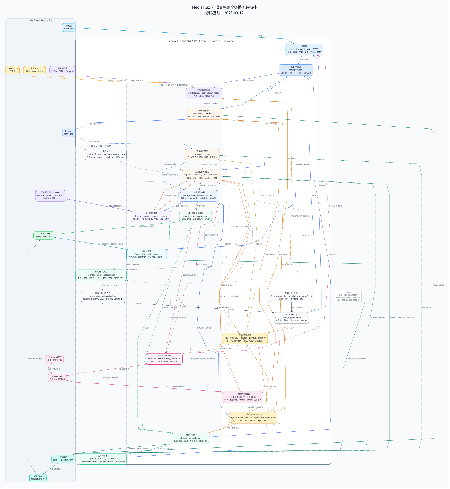
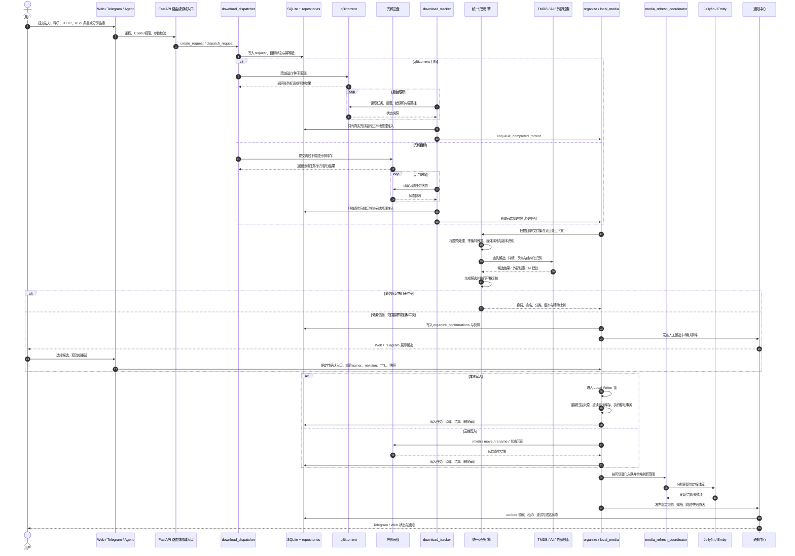
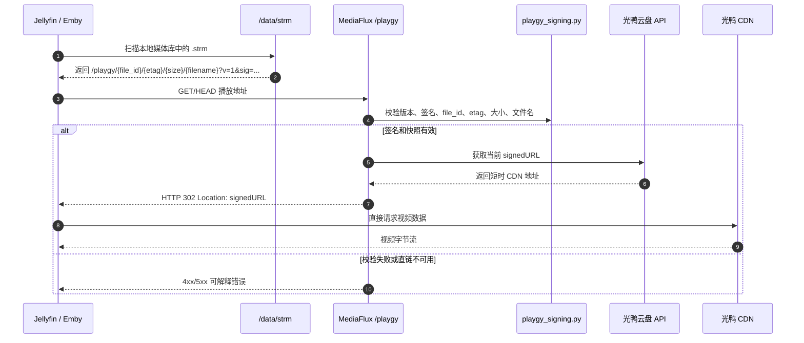
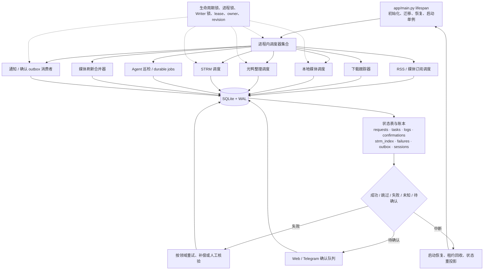
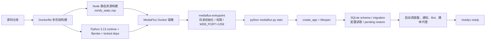

# MediaFlux 项目完整全链路流转拓扑图

> 生成日期：2026-09-12<br>
> 适用基线：当前工作区 `main`（不改变业务代码）<br>
> 目的：把 MediaFlux 从启动、入口接入、资源发现、下载、识别、整理、STRM 播放、媒体库刷新、通知到持久化恢复的主要流转，收敛成一份可维护、可追溯的拓扑视图。

## 0. 快速查看

### 总拓扑图



- **可视化成图**：[`architecture/mediaflux-full-chain-topology.svg`](architecture/mediaflux-full-chain-topology.svg)
- **可维护源图**：[`architecture/mediaflux-full-chain-topology.dot`](architecture/mediaflux-full-chain-topology.dot)
- **相关开发文档**：[`开发文档.md`](开发文档.md) 第 1、4、8–15 章
- **用户侧流程教程**：[`tutorials/00_自动化流转全景与工作流程.md`](tutorials/00_自动化流转全景与工作流程.md)

> SVG 是按当前源码与正式开发文档生成的总览图；下方 Mermaid 图按场景拆分，便于在支持 Mermaid 的 Markdown 阅读器中放大、复制和维护。

## 1. 一句话总览

```text
Docker/CLI 启动
  → FastAPI + Uvicorn 单 Worker
  → Web / Telegram / Agent / RSS / Indexer 等入口
  → 统一下载请求与状态跟踪
  → qBittorrent 本地分支 或 光鸭云盘分支
  → 统一识别、命名、分类、冲突和人工确认
  → 本地移动事务 或 光鸭远端整理
  → 本地媒体库刷新 或 STRM 增量同步
  → Jellyfin / Emby 扫描；STRM 播放时 /playgy 302 到光鸭 CDN
  → Telegram / Web / 日志输出
  → SQLite、outbox、失败账本、锁与恢复机制闭环
```

核心原则：

1. **入口统一**：Web、Telegram、RSS、Indexer、Agent 最终进入共享领域服务，不各自维护一套下载或整理实现。
2. **本地与云端共用识别**：标题预处理、TMDB/外部线索、季集推断、命名、版本与冲突策略统一；存储事务分别由本地移动和光鸭远端写入负责。
3. **预览与执行分离**：预览只生成候选/计划；真实写入需要执行入口、确认票据或确定性业务动作，并重新读取最新快照。
4. **状态先落库再扩散**：下载、整理、STRM、刷新、通知均有持久状态；异常进入重试、人工确认或恢复路径，不靠内存猜测成功。
5. **单进程单 Worker**：后台调度器、Telegram Polling、整理任务、媒体代理和写入锁均是进程内/跨进程协调的关键组成。

## 2. 主拓扑：从入口到媒体库

```mermaid
flowchart LR
    subgraph ENTRY[入口与触发]
        WEB[浏览器 / Web 控制台]
        TG[Telegram 用户]
        RSS[RSS / Mikan]
        IDX[资源站点 / Indexer]
        AG[Web / Telegram 自然语言]
    end

    subgraph ACCESS[MediaFlux 接入层]
        PAGES[Jinja2 页面 + 静态 JS/CSS]
        ROUTES[FastAPI routes /api/*<br/>Session · CSRF · 权限 · 输入校验]
        BOT[Telegram handlers + progress]
        KERNEL[Agent Kernel<br/>Session → Capability → ToolPipeline]
    end

    subgraph ORCH[统一编排与领域服务]
        DISC[Discovery / RSS / Indexer<br/>榜单、订阅、候选、筛选]
        DISPATCH[download_dispatcher.py<br/>协议识别 · 幂等 · 目标状态 · 重投]
        TRACK[download_tracker.py<br/>qB/光鸭完成判定 · 恢复 · 整理准入]
        RECOG[统一识别引擎<br/>扫描 → 预处理 → TMDB/AI → 命名/规格]
        ORG[整理协调器<br/>规划 · 冲突 · 确认 · 执行 · 审计]
    end

    subgraph BRANCH[存储分支]
        QB[qBittorrent]
        LOCAL[本地媒体流水线<br/>路径映射 · Writer 锁 · 移动事务]
        LOCALFS["/media/downloads + /media/library"]
        GY[光鸭云盘<br/>离线 / 分享 / 目录写入]
        STRM[STRM 引擎<br/>全量/增量 · 索引 · 失败重试]
        STRMFS["/data/strm<br/>.strm / NFO / 图片"]
    end

    subgraph EGRESS[出站与消费]
        REFRESH[media_refresh_coordinator<br/>合并、去重、分批刷新]
        MEDIA[Jellyfin / Emby<br/>媒体库扫描与播放]
        PLAY["/playgy 302 + media_proxy"]
        CDN[光鸭 CDN<br/>视频数据直达播放器]
        NOTIFY[Telegram outbox / Web SSE / 日志]
    end

    WEB --> PAGES --> ROUTES
    TG --> BOT
    AG --> KERNEL
    RSS --> DISC
    IDX --> DISC
    ROUTES --> DISC
    ROUTES --> DISPATCH
    ROUTES --> ORG
    ROUTES --> STRM
    BOT --> DISC
    BOT --> DISPATCH
    BOT --> ORG
    KERNEL --> DISC
    KERNEL --> DISPATCH
    KERNEL --> ORG
    KERNEL --> STRM

    DISC -->|RSS 条目 / 资源候选| DISPATCH
    DISPATCH -->|磁力 / 种子 / HTTP| QB
    DISPATCH -->|离线 / 分享转存| GY
    QB -->|进度 / 完成| TRACK
    GY -->|远端任务状态 / 完成| TRACK
    TRACK -->|qB 完成| LOCAL
    TRACK -->|光鸭完成| ORG
    LOCAL --> RECOG
    ORG --> RECOG
    RECOG -->|身份、季集、规格、命名计划| ORG
    ORG -->|本地目标| LOCAL
    LOCAL --> LOCALFS
    ORG -->|云端 mkdir / move / rename| GY

    ORG -->|可信变化| STRM
    STRM -->|扫描 / 读取云端文件| GY
    STRM --> STRMFS
    LOCAL -->|本地变化| REFRESH
    STRM -->|STRM 变化| REFRESH
    REFRESH --> MEDIA
    MEDIA -->|读取 .strm / 播放请求| PLAY
    PLAY -->|校验签名，获取 signedURL| GY
    GY -->|302 目标直链| CDN
    CDN -->|视频数据| MEDIA
    PLAY -.->|媒体服务器 HTTP/WebSocket 透传| MEDIA

    ORG --> NOTIFY
    LOCAL --> NOTIFY
    STRM --> NOTIFY
```



### 2.1 两条业务主分支

| 分支 | 触发与状态 | 写入结果 | 后续联动 |
| --- | --- | --- | --- |
| **qBittorrent → 本地** | qB 真实完成后由 `download_tracker` 创建本地媒体任务 | `local_media_service` 重新扫描、识别、冲突仲裁，再由 `local_move_transaction` 提交 | 本地媒体库刷新；按规则做 qB 收尾和高置信垃圾清理 |
| **光鸭 → 云端/STRM** | 光鸭离线/分享任务真实完成后进入云端整理 | `organize`/`organize_tasks` 通过光鸭客户端执行远端目录创建、移动、改名；`strm.py` 生成本地指针 | STRM 索引与增量同步；Jellyfin/Emby 刷新；播放时 `/playgy` 302 到 CDN |
| **双目标 `both`** | 同一下载请求分别记录 qB 与光鸭目标状态 | 只补投失败/缺失目标，不重复已成功目标 | 两条分支各自完成后，再分别进入本地/云端后处理 |

## 3. 典型入库时序：提交 → 下载 → 识别 → 整理 → 刷新 → 通知



### 3.1 重要时序语义

- 下载请求是**按目标独立记录**的：qB 成功不代表光鸭成功，反之亦然。
- `download_tracker` 只在真实完成后触发后续整理；提交结果未知时进入人工核验，不能盲目重复提交。
- 识别结果不直接等于写入：规划、冲突仲裁、最新库存复核和 Writer 提交是分开的阶段。
- 整理后的刷新进入持久化合并队列，避免同一媒体库短时间重复扫描。
- 通知是终态后的附属副作用；通知失败不应反向改写已经成功提交的媒体结果。

> **触发机制说明**：当前主链路是外部服务状态轮询 + SQLite 持久任务队列 + 执行时目录扫描；未发现 `watchdog`、`watchfiles`、`inotify` 或其它 OS 文件事件监听实现。

## 4. STRM 与 302 直链播放链路



**两种播放面不要混淆：**

- `/playgy`：只负责签名校验和获取光鸭直链，返回 302；视频数据不持续经过 MediaFlux。
- `media_proxy`：固定上游代理 Jellyfin/Emby 的 HTTP/WebSocket 请求，可改写 PlaybackInfo 并记录播放审计；它不是 `/playgy` 的替代品。

## 5. Media Agent 跨端流转

```mermaid
flowchart LR
    WEB_A[Web /api/agent] --> INPUT[AgentInput]
    TG_A[Telegram Agent] --> INPUT
    INPUT --> SESSION[AgentSession<br/>owner + session + 引用]
    SESSION --> RETRIEVE[CapabilityRetriever<br/>召回当前可用工具]
    RETRIEVE --> MODEL[OpenAI-compatible Provider<br/>Responses / Chat / Anthropic]
    MODEL --> PIPE[ToolPipeline<br/>参数 · 引用 · 授权 · 限流 · 风险]

    PIPE --> READ{READ 还是 WRITE/DANGER?}
    READ -->|READ| ACTION[领域 Action / Provider / Repository]
    ACTION --> RESULT[结构化结果投影]
    RESULT --> MODEL

    READ -->|WRITE/DANGER| PLAN[EffectPlan<br/>冻结参数、快照、owner、TTL]
    PLAN --> APPROVAL[effect.approval_required<br/>Web / Telegram 展示确认]
    APPROVAL --> CONFIRM[用户确认 / 取消]
    CONFIRM --> CHECK[确定性重验<br/>owner · generation · revision · snapshot]
    CHECK --> ACTION

    ACTION --> EVENT[AgentEvent<br/>工具、确认、取消、最终回答]
    EVENT --> WEB_OUT[Web 事件流 / 页面状态]
    EVENT --> TG_OUT[Telegram 文本 / 草稿 / 按钮]
```



Agent 不绕过领域服务直接写文件或调用 Provider：

- Web 与 Telegram 共享同一 Kernel、事件协议和领域 Action。
- READ 可以在同一模型回合继续推理；WRITE/DANGER 先冻结计划，确认阶段不再调用模型。
- 资源候选、分享转存、下载提交和整理确认使用带 TTL 的 opaque ref/快照，防止迟到回合或跨会话串用。
- Agent 关闭时，页面入口、Telegram Agent、下载后复核和全库巡检统一受 `feature_gate` 控制，但历史和配置保留。

## 6. 后台调度、持久化与故障闭环



### 6.1 关键持久化对象

| 状态域 | 代表表/目录 | 作用 |
| --- | --- | --- |
| 下载 | `download_requests`、`download_log`、staging 相关表 | 记录来源、qB/光鸭目标状态、重投、未知结果和后处理准入 |
| 整理 | `organize_log`、`organize_log_items`、`organize_operation_steps` | 记录识别、命名、移动、替换、回退和逐文件结果 |
| 确认 | `organize_confirmations`、confirmation delivery outbox | 保存候选、目录指纹、TTL、Telegram/Web 关联和一次性执行权 |
| 本地媒体 | `local_media_sources`、`local_media_tasks`、operation steps | 来源、目标、扫描、Writer 任务和事务状态 |
| STRM | `strm_index`、`strm_failures`、`strm_retired_sources`、`/data/strm` | 远端文件映射、增量指针、失败重试和来源退役 |
| 通知 | `telegram_notification_outbox`、`media_subscription_notification_outbox` | 事件去重、领取租约、重试、送达和跨重启恢复 |
| Agent | `agent_*` 表与加密引用 | 会话、事件、动作历史、EffectPlan、额度、巡检和补偿凭证 |
| 代理/播放 | `media_proxy_*` | 代理实例、绑定、PlaybackInfo 处理和播放审计 |
| 运维 | `user.env`、cache、logs、backup | 配置、缓存、运行日志、备份、迁移与恢复 |

## 7. 部署与启动链路



- 官方 Compose 将 `./data` 挂载到 `/app/db`，`./strm` 挂载到 `/data/strm`，并挂载下载目录和媒体库目录。
- 生产运行必须保持一个 MediaFlux 进程、一个 Uvicorn Worker，避免调度器、Telegram Polling、写锁和数据库状态被重复占用。
- `healthz` 表示 HTTP 服务可响应；`readyz` 表示 lifespan 初始化与后台运行时已进入 ready 状态。

## 8. 源码锚点

| 拓扑节点 | 源码锚点 | 责任 |
| --- | --- | --- |
| 启动入口 | `mediaflux.py:1-5`；`app/cli.py:21-70, 96-130` | CLI 命令、运行目录、Uvicorn 单 Worker 启动 |
| 应用工厂 | `app/main.py:271-315, 495-575, 743-803` | 后台服务启停、恢复、数据库初始化、路由注册与 lifespan |
| 页面与 API | `app/routes/pages.py:32-378`；`app/main.py:769-803` | 页面入口与路由族注册 |
| Telegram | `app/bot/handlers.py:1265-1889, 2349-2782, 3778-3923` | 命令、普通消息、回调、进度、Bot 生命周期 |
| Agent Kernel | `app/agent/kernel/session.py:507-530, 719-769, 1048-1054`；`app/agent/kernel/pipeline.py` | 模型循环、工具管线、确认执行、事件流 |
| 统一下载 | `app/modules/download_dispatcher.py:336-420, 914-1010` | 请求建模、目标分发、幂等与缺失目标重投 |
| 下载跟踪 | `app/modules/download_tracker.py:73-145, 544-595` | qB/光鸭对账、完成判定、本地任务准入 |
| 本地媒体 | `app/modules/local_media_scheduler.py:104-245, 825-863`；`app/modules/local_media_service.py` | 扫描任务、并行只读预热、单 Writer 执行与移动事务 |
| 统一识别/整理 | `app/modules/organize.py:1-15, 314-330, 2435-2524`；`app/modules/scraper.py:3797-3850` | 扫描、识别、命名、冲突、执行与后处理 |
| 光鸭离线/分享 | `app/modules/offline.py:396-438, 514-560`；`app/modules/share_transfer.py:412-530` | 解析、文件选择、离线提交、分享转存与状态 |
| STRM | `app/modules/strm.py:1-8, 716-760, 1893-1927, 2746-2851`；`app/modules/scheduler.py:347-491` | 指针生成、全量/增量同步、索引、失败与调度 |
| 302 播放 | `app/routes/proxy.py:29-180`；`app/modules/playgy_signing.py:45-53` | 签名校验、获取 signedURL、302 重定向 |
| 媒体库刷新 | `app/modules/media_refresh_coordinator.py:74-185, 297-419` | 路径合并、去重、分批刷新与重试 |
| 通知中心 | `app/modules/telegram_notification_center.py:452-692`；`app/notifier.py:236-260` | 事件持久化、outbox、租约、重试与 Telegram 投递 |
| 数据库 | `app/database.py:418-603`；`app/database_schema.py:1-313` | schema、迁移、WAL、事务与领域表 |
| 容器运行 | `Dockerfile:1-79`；`packaging/scripts/docker-entrypoint.sh:22-81`；`docker-compose.yml:1-35` | 静态构建、Python runtime、目录挂载、权限和健康检查 |

## 9. 阅读边界与维护提示

- 本图按**当前真实主要调用链**做领域级抽象，不把每个 API 端点、每个 Agent 工具或每张表都画成独立节点。
- “统一识别引擎”包含标题预处理、知识包、季集映射、TMDB 严格复核、AI/外部线索、媒体规格探测和命名规则；不代表所有外部 Provider 每次都会调用。
- 真实外部服务的网络可达性、账号权限、云盘任务排队时间和媒体服务器版本差异不在本图验证范围内。
- 修改任一功能时，应沿着“页面/Telegram/Agent 入口 → API 边界 → 领域服务 → 数据库状态 → 通知 → STRM/刷新/qB 收尾 → 测试”的纵向顺序核验。
- 重新生成 SVG 时使用：

```bash
 dot -Tsvg docs/architecture/mediaflux-full-chain-topology.dot \
   -o docs/architecture/mediaflux-full-chain-topology.svg
```

- 该文档是正式维护文档；Agent 内部计划、审查和临时截图仍放在被忽略的 `.superpowers/`，不应提交。
